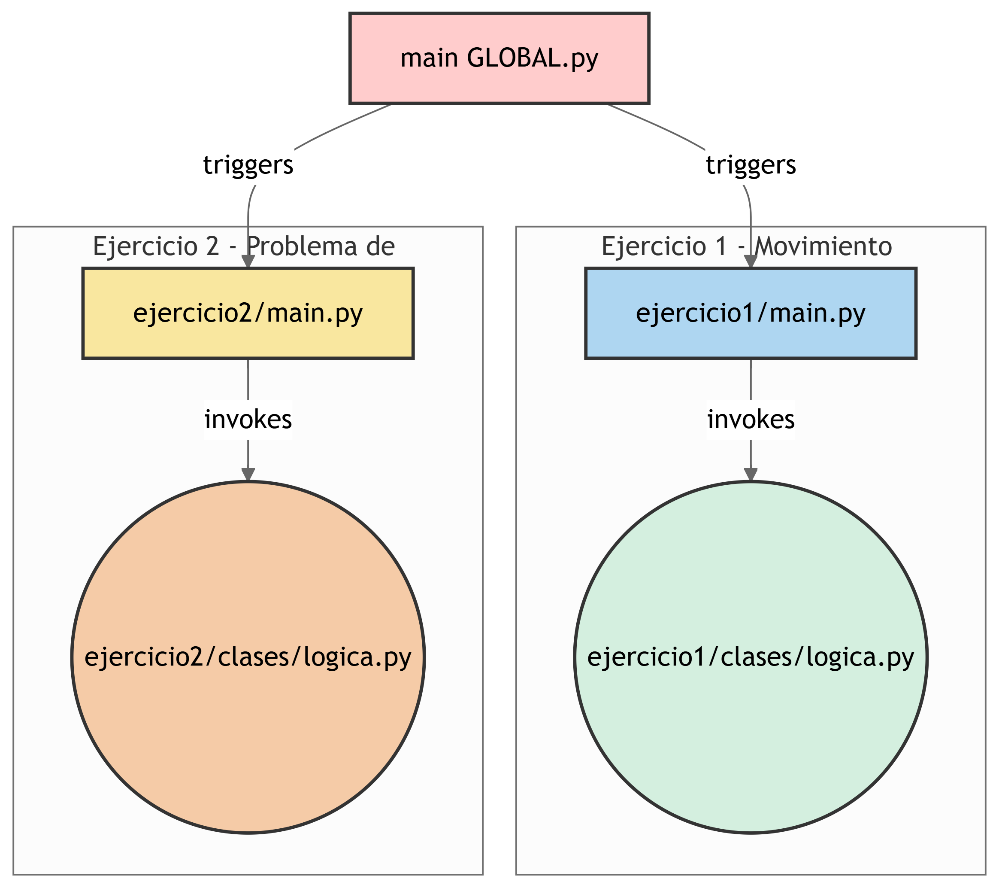

https://github.com/Alvarojorgeg/ejercicio-algoritmos


# Ejercicio Algoritmos

Este repositorio contiene dos ejercicios de algoritmos implementados en Python. Cada ejercicio está organizado en su propio directorio y aborda un problema específico.

## Estructura del Proyecto

```
ejercicio1/
    main.py
    clases/
        logica.py
ejercicio2/
    main.py
    clases/
        logica.py
```

### Ejercicio 1: Movimiento del Caballo

Este ejercicio implementa un algoritmo para calcular la cantidad de movimientos válidos que puede realizar un caballo en un tablero de ajedrez, dados un número específico de pasos.

- **Archivo principal**: `ejercicio1/main.py`
- **Lógica**: `ejercicio1/clases/logica.py`
- **Clase principal**: `MovimientoCaballo`
  - Métodos:
    - `movimientos_validos(pasos)`: Calcula el número total de movimientos válidos para el caballo en un tablero de ajedrez.

#### Ejecución

Para ejecutar este ejercicio, usa el siguiente comando:

```bash
python ejercicio1/main.py
```

### Ejercicio 2: Problema de las N-Reinas

Este ejercicio resuelve el problema de las N-Reinas, que consiste en colocar N reinas en un tablero de ajedrez de tamaño NxN de manera que ninguna reina ataque a otra.

- **Archivo principal**: `ejercicio2/main.py`
- **Lógica**: `ejercicio2/clases/logica.py`
- **Clase principal**: `NReinas`
  - Métodos:
    - `resolver(n)`: Encuentra todas las soluciones posibles para el problema de las N-Reinas.
    - `colocar(actual, fila, n, soluciones)`: Coloca las reinas recursivamente.
    - `es_valido(actual, fila, col)`: Verifica si una posición es válida para colocar una reina.

#### Ejecución

Para ejecutar este ejercicio, usa el siguiente comando:

```bash
python ejercicio2/main.py
```

## Requisitos

- Python 3.10 o superior.
